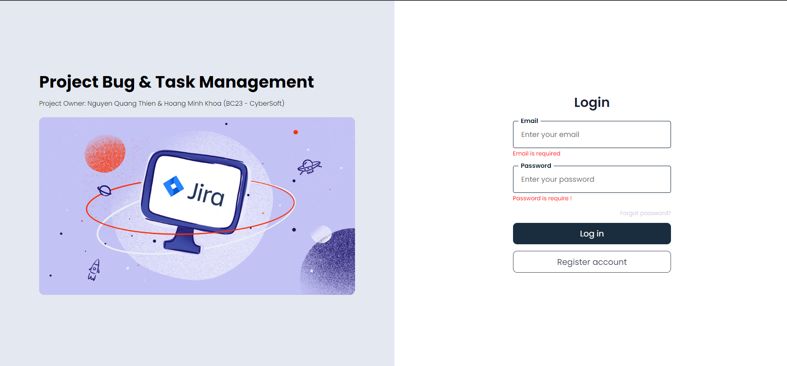
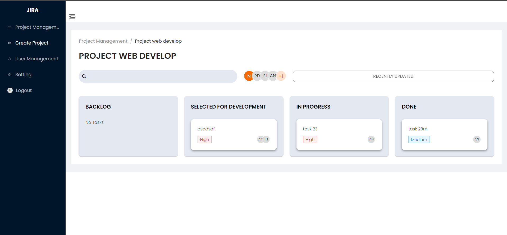

<h2>Project Bug & Task Management </h2>

Author: Nguyen Quang Thien & Hoang Minh Khoa
(CyberSoft)

[View Demo](https://bug-jira.surge.sh/)

<!-- //Screen Task

(Thien)- Login, Register (Done) ;
(Khoa) - LayoutMain & NavLink (Done);
(Khoa) - Project Management (Add/Remove User , Edit/Delete Project) (Done);
(Thien)- Create Project (Done)
(Thien)- Project Details (use Drag & Drop to move task) (Done)
(Thien)- Create Task, Information & Edit Task (Done);
(Thien)- Task Details (Comment, Status, Members, Priority...) (Done);
(Khoa)- User Management (Giống Project Management, thêm xóa sửa user) (Done);

-->
